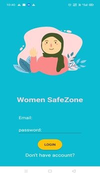
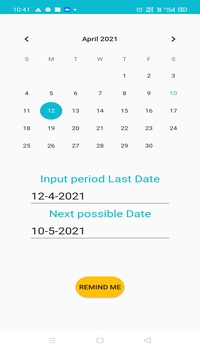
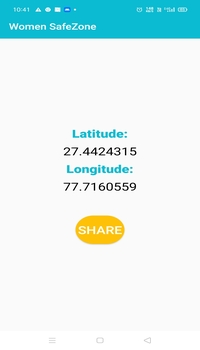
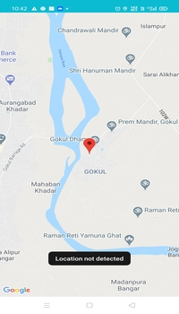

  
  
 

# THEME: WOMEN SAFETY

# Women SafeZone - An Application for Women Safety
<b>INTRODUCTION </b>

A complete women safety mechanism is required, to make the country more safe for women. For fulfilling one of those aspects, we have came up with a project- <b> Women SafeZone </b>  
Women SafeZone is an android application built for women saftey.
It tracks the location of the user, in order to provide help as soon as possible in the case of any emergency.

# Features/Table of Contents:
- Location Tracking
- Location Sharing
- Emergency Calling
- Period Tracker
 
# Technology Stack:
-Android Development Using Java

# Contributors:

TEAM NAME: <b>GoalDiggers</b>
- [Riya Mathur](https://github.com/Blitzcoder01)
- [Neha Adnekar](https://github.com/Nehaadnekar)

# Made at:
 
 
# Layout:
 &nbsp;  &nbsp;
   &nbsp;    

# Contacts:
Feel free to contact us if you have any further queries, at:
<riya.mathur_cs18@gla.ac.in>, 
<neha.adnekar_cs18@gla.ac.in>, 
